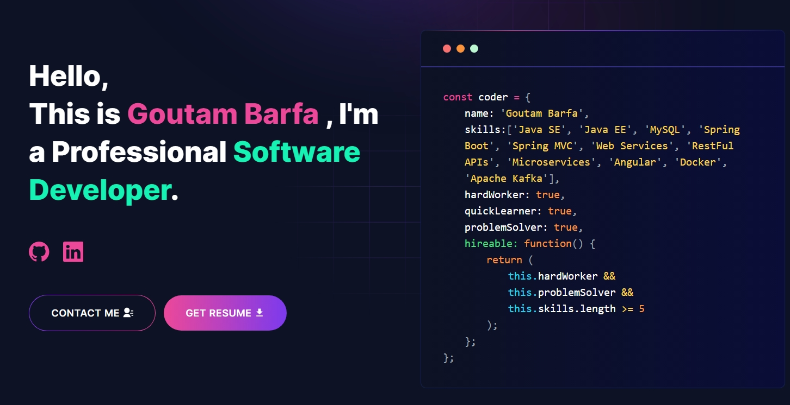

<p align="center" width="100%">
    
</p>

---
# [Built Portfolio With GitHub ](https://github.com/Goutam-09)

---

# Developer Portfolio

### Are you struggling to create a professional portfolio website? Look no further! You can use the Developer Portfolio template and create your very own personalized portfolio today! My website is designed to be user-friendly and easily customizable, making it perfect for both developers and freelancers.

---

# Demo :movie_camera:



## View live preview [here](https://goutambarfa.netlify.app/).

---

## Table of Contents :scroll:

- [Sections](#sections-bookmark)
- [Demo](#demo-movie_camera)
- [Installation](#installation-arrow_down)
- [Getting Started](#getting-started-dart)
- [Usage](#usage-joystick)
- [Packages Used](#packages-used-package)

---

# Sections :bookmark:

- HERO SECTION
- ABOUT ME
- EXPERIENCE
- SKILLS
- PROJECTS
- EDUCATION
- CONTACTS

---

# Installation :arrow_down:

### You will need to download Git and Node to run this project

- [Git](https://git-scm.com/downloads)
- [Node](https://nodejs.org/en/download/)

#### Make sure you have the latest version of both Git and Node on your computer.

```
node --version
git --version
```

## <br />

# Getting Started :dart:

### Fork and Clone the repo

To Fork the repo click on the fork button at the top right of the page. Once the repo is forked open your terminal and perform the following commands

```
git clone https://github.com/<YOUR GITHUB USERNAME>/developer-portfolio.git

cd developer-portfolio
```

### Install packages from the root directory

```bash
npm install
# or
yarn install
```

Then, run the development server:

```bash
npm run dev
# or
yarn dev
```

Open [http://localhost:3000](http://localhost:3000) with your browser to see the result.

---

# Usage :joystick:

Goto [emailjs.com](https://www.emailjs.com/) and create a new account for the mail sending. In free trial you will get 200 mail per month. After setup `emailjs` account, Please create a new `.env` file from `.env.example` file.

Eg:

```env
NEXT_PUBLIC_EMAILJS_SERVICE_ID =
NEXT_PUBLIC_EMAILJS_TEMPLATE_ID =
NEXT_PUBLIC_EMAILJS_PUBLIC_KEY =
NEXT_PUBLIC_GTM = # For site analytics
NEXT_PUBLIC_APP_URL = "http://127.0.0.1:3000"
NEXT_PUBLIC_RECAPTCHA_SECRET_KEY = # For captcha verification on contact form
NEXT_PUBLIC_RECAPTCHA_SITE_KEY =
```

### Then, Customize data in the `utils/data` [folder](https://github.com/Goutam-09).

Eg:

```javascript
export const personalData = {
  name: "Goutam Barfa",
  profile: '/profile.JPG',
  designation: "Software Developer",
  description: "Hello, I'm Goutam Barfa, a seasoned full-stack Java developer. I bring a wealth of experience and passion for programming to my work. I'm always eager to delve into new technologies and methodologies. I thrive on the challenges of full-stack development, from crafting robust backend solutions to creating intuitive frontend interfaces. My expertise spans across the entire web development spectrum, with a strong foundation in Java. I'm actively seeking opportunities that allow me to contribute my expertise to exciting projects in the realm of full-stack Java development",
  email: 'goutambarfa@2gmail.com',
  phone: '+91 9669132284',
  address: 'Indore, Madhya Pradesh',
  github: 'https://github.com/Goutam-09',
  facebook: '',
  linkedIn: 'https://www.linkedin.com/in/goutam-barfa',
  twitter: '',
  stackOverflow: '',
  leetcode: "",
  devUsername: "",
  resume: "https://drive.google.com/file/d/1nqLibqrRf-9vO2NcMD1mgBp0c9Gd9gme/view?usp=sharing",
  skills: ['Java SE', 'Java EE', 'MySQL','Spring Boot','Spring MVC', 'Web Services', 'RestFul APIs', 'Microservices', 'Angular', ]
};
```

`devUsername` Used for fetching blog from `dev.to`.

---

---

# Packages Used :package:

| Used Package List  |
| :----------------: |
|        next        |
|  @emailjs/browser  |
|    lottie-react    |
| react-fast-marquee |
|    react-icons     |
|   react-toastify   |
|        sass        |
|    tailwindcss     |

---
